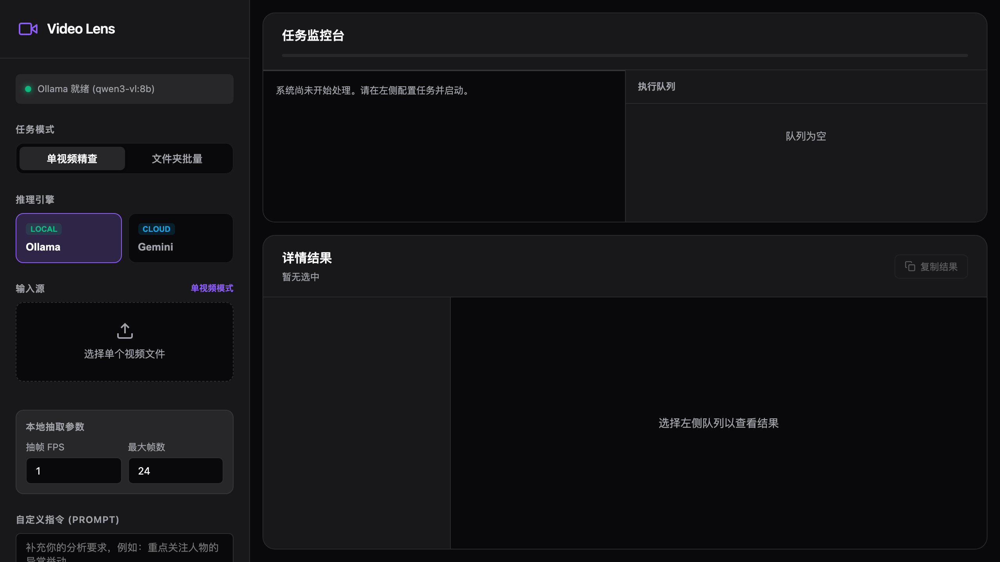

# Video Lens

`Video Lens` 是一个本地运行的视频分析 Web 应用，用来把“选视频 -> 调模型 -> 看结果”这条流程做成普通用户也能直接操作的工作台。

它支持两条分析路径：

- `Ollama + qwen3-vl:8b`
  适合本地离线、隐私优先、希望把模型放在自己电脑上运行的场景。
- `Gemini Video API`
  适合希望直接上传视频文件到云端视频接口的场景。

用户可以分析单个视频，也可以一次选择整个文件夹，让系统顺序处理并保留每个视频的独立结果。

## 界面预览



## 功能特性

- 单视频分析
- 整文件夹批量分析
- 实时任务状态与日志
- 队列视图与单条结果详情
- 本地 `Ollama` 路线
- 云端 `Gemini` 路线
- 中文结构化结果输出

## 适合谁使用

- 想用 AI 分析本地视频，但代码基础有限的人
- 想批量处理一个文件夹视频的人
- 想对比本地模型与云端视频接口的人
- 想把视频理解能力包装成一个可操作工具，而不是命令行脚本的人

## 运行原理

从用户视角，你直接选择视频文件即可。

从系统实现视角，有两条不同路线：

### Ollama 路线

1. 读取视频元数据
2. 自动抽取关键帧
3. 把关键帧按顺序发送给本地视觉模型
4. 返回中文分析结果

这条路线适合本地部署和隐私优先场景。

### Gemini 路线

1. 直接上传视频文件到 Gemini Files API
2. 等待服务端处理完成
3. 调用视频理解接口生成结果

这条路线适合希望直接上传视频、减少本地模型配置的人。

## 运行前需要准备什么

### 1. Python

后端使用 Python 标准库实现，不依赖额外第三方 Python 包。

推荐版本：

- `Python 3.11+`

检查命令：

```bash
python3 --version
```

### 2. ffmpeg / ffprobe

用于读取视频元数据和抽取关键帧。

检查命令：

```bash
ffmpeg -version
ffprobe -version
```

安装方式：

- macOS：

```bash
brew install ffmpeg
```

- Windows：

```powershell
winget install Gyan.FFmpeg
```

- Ubuntu / Debian：

```bash
sudo apt update
sudo apt install ffmpeg
```

### 3. Ollama（如果你要使用本地模型）

下载地址：

- [https://ollama.com/download](https://ollama.com/download)

安装后确认服务可用：

```bash
ollama list
```

或者：

```bash
curl http://127.0.0.1:11434/api/tags
```

### 4. 拉取默认本地模型

本项目默认使用：

- `qwen3-vl:8b`

拉取命令：

```bash
ollama pull qwen3-vl:8b
```

### 5. Gemini API Key（可选）

如果你只用 `Ollama`，这一项可以跳过。

如果你想使用 `Gemini` 路线，需要准备一个 Gemini API Key，然后在网页表单中填写：

- `Gemini API Key`
- `Gemini 模型名`

默认模型名：

- `gemini-2.5-pro`

## 快速开始

### 1. 克隆仓库

```bash
git clone https://github.com/Alansws/video-lens.git
cd video-lens
```

### 2. 启动项目

```bash
python3 app.py
```

成功后会看到：

```text
Video Lens running at http://127.0.0.1:8765
```

### 3. 打开浏览器

访问：

```text
http://127.0.0.1:8765
```

### 4. 开始使用

#### 单视频分析

1. 选择 `单个视频`
2. 选择 `Ollama` 或 `Gemini`
3. 选择一个视频文件
4. 可选填写附加要求
5. 点击 `开始分析`

#### 批量分析整个文件夹

1. 选择 `整个文件夹`
2. 选择 `Ollama` 或 `Gemini`
3. 选择一个包含多个视频的文件夹
4. 可选填写附加要求
5. 点击 `开始批量分析`

系统会自动：

- 识别其中的视频文件
- 按顺序处理
- 为每个视频保留独立结果
- 在队列中展示状态和日志

## 配置项

项目支持通过环境变量调整默认行为：

| 变量名 | 默认值 | 说明 |
| --- | --- | --- |
| `APP_HOST` | `127.0.0.1` | 本地服务监听地址 |
| `APP_PORT` | `8765` | 本地服务端口 |
| `OLLAMA_API_BASE` | `http://127.0.0.1:11434/api` | Ollama API 地址 |
| `OLLAMA_MODEL` | `qwen3-vl:8b` | 本地默认模型 |
| `DEFAULT_OLLAMA_FPS` | `1` | Ollama 路线默认抽帧 FPS |
| `DEFAULT_OLLAMA_MAX_FRAMES` | `24` | Ollama 路线默认最大帧数 |
| `DEFAULT_GEMINI_MODEL` | `gemini-2.5-pro` | Gemini 默认模型 |
| `MAX_UPLOAD_MB` | `512` | 单次请求最大上传体积 |

例如：

```bash
APP_PORT=9000 OLLAMA_MODEL=qwen3-vl:8b python3 app.py
```

## 提示词示例

```text
请按时间顺序总结视频内容，列出出现的人物、场景、动作，并指出你不确定的地方。
```

```text
请重点分析视频中的产品展示、人物动作和镜头变化。
```

```text
请帮我判断视频是否存在明显的广告感、摆拍感或场景不一致问题。
```

## 常见问题

### 页面显示 Ollama 未就绪

先检查：

```bash
ollama list
```

如果没有返回模型列表，说明 `Ollama` 服务没有正常运行。

### 找不到 `qwen3-vl:8b`

执行：

```bash
ollama pull qwen3-vl:8b
```

### 找不到 `ffmpeg` / `ffprobe`

说明系统没有安装视频工具，按前文安装即可。

### 批量分析为什么比较慢

当前版本采用顺序处理，以稳定性、可追踪日志和单视频结果可定位性为优先。

### 为什么文件夹上传在某些浏览器不可用

文件夹批量选择依赖浏览器对目录上传的支持。建议优先使用较新的 Chromium 系浏览器。

## 项目结构

```text
.
├── app.py
├── README.md
├── CONTRIBUTING.md
├── LICENSE
├── docs
│   └── TECH_STACK.md
└── static
    ├── app.js
    ├── index.html
    └── styles.css
```

## 文档

- 技术栈与设计思路：[docs/TECH_STACK.md](docs/TECH_STACK.md)
- 协作说明：[CONTRIBUTING.md](CONTRIBUTING.md)

## 开发检查

项目当前最基本的本地检查方式：

```bash
python3 -m py_compile app.py
node --check static/app.js
```

## 贡献

欢迎 issue 和 PR。开始前建议先看：

- [CONTRIBUTING.md](CONTRIBUTING.md)

## 许可证

本项目使用 [MIT License](LICENSE)。
